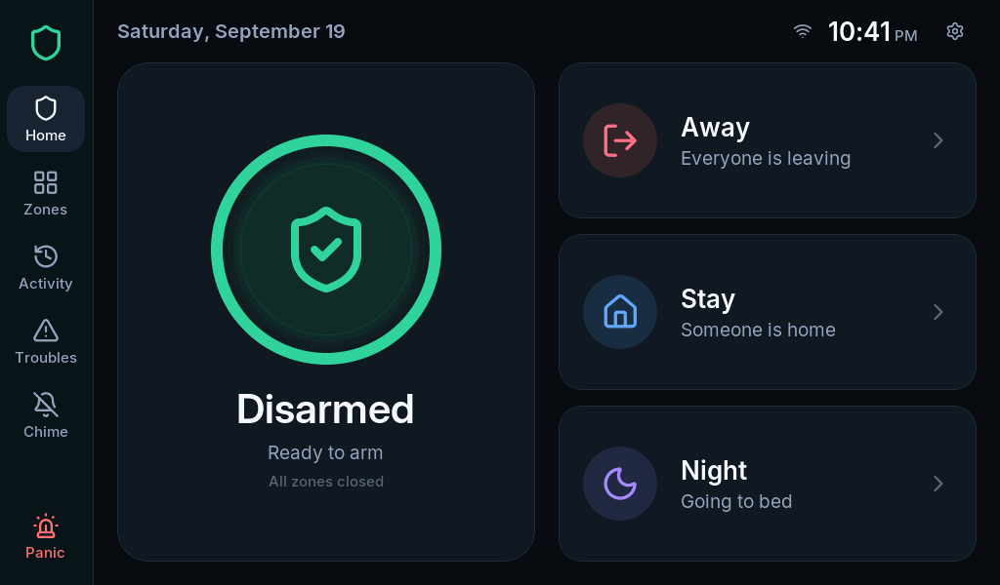

<p align="center">
  
</p>

<h1 align="center">RoboAlarms Panel for Home Assistant</h1>

<p align="center">
  <a href="https://github.com/RoboAlarms/ha-addon/actions/workflows/validate.yml"></a>
  <a href="https://github.com/RoboAlarms/ha-addon/actions/workflows/tests.yml"></a>
  <a href="https://github.com/hacs/integration"></a>
  
  <a href="LICENSE"></a>
</p>

<p align="center">
  
</p>

<p align="center"><em><strong>RoboAlarms</strong> is an open-source alarm system — the panel firmware, the touchscreen experience above, and this Home Assistant integration — <strong>coming soon</strong>.</em></p>

A local integration for the **RoboAlarms Panel** — an open-source touchscreen alarm
panel built on the Elecrow CrowPanel Advanced 7″ (ESP32-P4).
Home Assistant discovers the panel on your network, you confirm the pairing **on the
panel's screen**, and the panel shows up with its partitions, zones, troubles and
events. Everything stays on your LAN: no cloud, no MQTT broker, no credentials to type.

> [!IMPORTANT]
> **Early development.** The panel firmware's local API is being built right now, and
> this integration is being built against it. It is not yet usable in a live Home
> Assistant — star or watch the repository to catch the first release.

## How it works

1. The panel advertises itself with mDNS (`_roboalarms._tcp`) while its Home
   Assistant integration is switched on (panel: *Settings > Integrations > Home Assistant*).
2. Home Assistant shows it under **Settings > Devices & services > Discovered**.
3. You click **Add**, open the pairing screen on the panel, and check that both
   screens show the **same 6-digit code** before tapping *Allow* on the panel.
4. From then on the two talk over a mutually authenticated TLS connection with
   pinned certificates. State changes are pushed to Home Assistant within a second;
   the panel holds no Home Assistant credential, and Home Assistant holds no alarm code.

Arming and disarming from Home Assistant always requires a user code, which the
panel checks with the same rules as its own keypad — including lockout after
repeated wrong codes. Duress codes never reveal themselves in Home Assistant:
the alarm state stays normal and the event is marked silent.

## What you get

| Platform | Entities |
|---|---|
| Alarm control panel | One per partition, with Home / Away / Night arming |
| Binary sensor | Every zone (door, window, motion, smoke…) with its proper device class, plus tamper, low battery and supervision diagnostics per zone, and panel-wide trouble, AC power and installer-mode sensors |
| Sensor | Zone battery and signal where the sensor reports them; panel Wi-Fi signal and uptime |
| Switch | Chime, per partition |
| Button | Restart the exit delay |
| Event | Panel events (armed, disarmed, alarm, trouble…) for automations |
| Update | Panel firmware updates |

Each zone is its own device under the panel, so you can assign it to an area and
see it on your dashboards where it belongs. Zones added or renamed on the panel
appear in Home Assistant without a restart.

**Planned (two-way):** an options flow to choose which Home Assistant entities the
panel may use as alarm zones and which devices (lights, locks, climate, covers) it
may show on its own Devices screen. The panel only ever sees what you allow.

## Requirements

- Home Assistant **2026.3 or newer**
- A RoboAlarms Panel on the same network (mDNS discovery needs the same subnet,
  or an mDNS reflector across VLANs)
- The integration enabled on the panel: *Settings > Integrations > Home Assistant*

## Installation

### HACS (recommended)

[](https://my.home-assistant.io/redirect/hacs_repository/?owner=RoboAlarms&repository=ha-addon&category=integration)

Or by hand: **HACS > ⋮ > Custom repositories**, add
`https://github.com/RoboAlarms/ha-addon` with type *Integration*, then search for
**RoboAlarms**, download it and restart Home Assistant.

### Manual

Copy `custom_components/roboalarms` into the `custom_components` folder of your
Home Assistant configuration directory and restart Home Assistant.

## Setup

[](https://my.home-assistant.io/redirect/config_flow_start/?domain=roboalarms)

1. The panel appears under **Settings > Devices & services > Discovered** — click
   **Add**. (No discovery? *Add integration*, search for **RoboAlarms** and enter
   the panel's address; it's shown on the panel under *Settings > Integrations*.)
2. On the panel, open *Settings > Integrations > Home Assistant* and tap **Pair**
   (the panel asks for your master or installer code; pairing stays open for two
   minutes).
3. Both screens show a 6-digit code. If they match, tap **Allow** on the panel.
4. Done — the panel and its zones appear as devices.

If the panel is ever factory-reset, Home Assistant raises a repair issue asking you
to pair again. Moving the panel to a new address is picked up automatically from
discovery, or via *Reconfigure* on the integration entry.

## The MQTT alternative

The panel also speaks plain MQTT with Home Assistant discovery, for setups with
their own broker (or Node-RED and friends). This integration is the recommended
path — it needs no broker, pairs on the panel and carries the two-way features —
but the MQTT path remains supported by the panel firmware.

## Troubleshooting

- **Not discovered** — discovery relies on mDNS: the panel and Home Assistant must
  be on the same subnet, or your network needs an mDNS reflector (e.g. avahi).
  Adding the panel by its address works regardless.
- **"Could not reach the panel"** — check that the integration is enabled on the
  panel (*Settings > Integrations > Home Assistant*) and that nothing between the
  two blocks TCP port 6054.
- **Pairing code mismatch** — the codes differ only when something on the network
  is interfering with the connection. Don't accept a mismatch; try again on a
  trusted network.

## Development status

| Milestone | Scope | Status |
|---|---|---|
| Panel local API | TLS server, pairing, state, events, commands in the panel firmware | Discovery, hello and pairing built; state, events and commands in progress |
| Protocol client | `aioroboalarms` (inside this integration until it moves to PyPI) | Framing, hello and pairing done, tested against a fake panel |
| This integration | Config flow, entities, diagnostics, repairs | Discovery, connection test and on-panel pairing done; entities next |
| Two-way | HA entities as panel zones, panel device control | Both directions built here: shared entities become panel zones, and the panel's device actions run against your allow-list; the panel's Devices screen itself is being built in the firmware |

## Contributing

Issues and pull requests are welcome. Run the checks locally before opening one
(Python 3.14, the version Home Assistant itself runs on):

```bash
pip install -r requirements_test.txt ruff
pytest
ruff check .
```

## License

[Apache-2.0](LICENSE)
